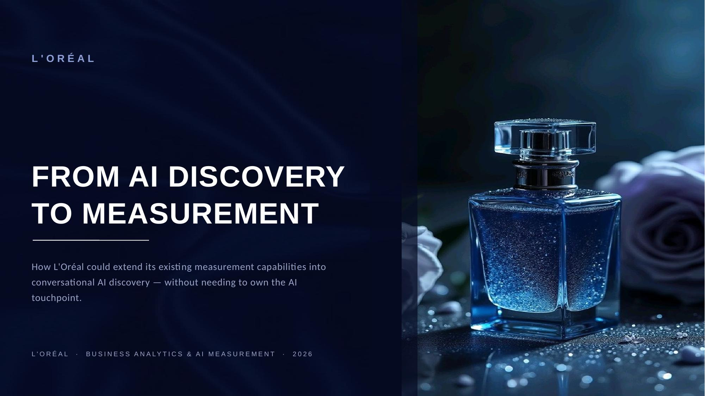

# From AI Discovery to Measurement
### How L'Oréal could extend its existing measurement discipline into conversational AI — without needing to own the AI touchpoint

**[📄 Read the full deck (PDF)](./From-AI-Discovery-to-Measurement.pdf)** · **[📊 Editable slides (PPTX)](./From-AI-Discovery-to-Measurement.pptx)** · **[📈 Analysis workbook (Excel)](./LOreal_AI_Discovery_Analysis.xlsx)**

---

## The question

As beauty discovery moves into conversational AI, how can L'Oréal extend its existing data-collaboration model to measure AI-driven demand — without needing to own the AI touchpoint or compete with retail partners for the customer relationship?

## What the data actually shows

Working from L'Oréal's own five years of public financial disclosures (2021–2025), two findings challenge assumptions a surface-level read would miss:

- **E-commerce share didn't rise in a straight line.** It fell from 28.9% to 27.0% between 2021–2023, then recovered to 28.2% in 2024 and reached 30.2% in 2025. The dip wasn't e-commerce slowing down — the rest of the business was simply growing faster in those two years.
- **Growth and margin moved in different directions overall.** Like-for-like sales growth fell from 16.1% in 2021 to 4.0% in 2025, with a small uptick in 2023, while operating margin rose every year from 19.1% to 20.2%. The chart states plainly what it does and doesn't prove: this shows two metrics moving oppositely, not that one caused the other.

That second finding sets up the actual subject of the project: if a *measured* channel behaves this unevenly, what happens to a new, *harder-to-measure* one — like AI-driven discovery?

## The measurement problem

In June 2026, L'Oréal announced a partnership with OpenAI spanning AI-powered discovery, a Maybelline virtual try-on feature, and an advertising pilot with three brands. That's real. What's not yet established is whether L'Oréal can currently *measure* what that partnership delivers.

This project:

1. **Separates attribution from incrementality** — a tracking tag proving an AI referral happened is not the same as proving it caused a sale.
2. **Builds a six-layer measurement framework** (Visibility Proxy → Interaction → Referral → Conversion → Incrementality → Repeat Value), rating what each layer actually depends on rather than assigning a confidence score.
3. **Designs a feasibility-gated pilot** for L'Oréal's real, paid ChatGPT ad placement — one that checks whether the required targeting and reporting exist *before* assuming a test can run, rather than after.
4. **Audits every AI-related claim** used in the analysis against public evidence, sorted into what's announced, what's documented at the platform level, and what remains genuinely unknown for L'Oréal specifically.

See **[METHODOLOGY.md](./METHODOLOGY.md)** for how each of these was actually built, including one real correction I made mid-project after checking my own assumption against the evidence.

## What's in this repo

| File | What it is |
|---|---|
| `From-AI-Discovery-to-Measurement.pdf` | The full 14-slide analysis — 8 main slides, 6-slide appendix with every underlying calculation |
| `From-AI-Discovery-to-Measurement.pptx` | Same deck, editable, with native (not image-based) charts |
| `LOreal_AI_Discovery_Analysis.xlsx` | The full analytical workbook — every formula live, every hardcoded input sourced |
| `METHODOLOGY.md` | How the numbers were built, what's proven vs. proposed, and the limitations |
| `SOURCES.md` | Every dataset used, with links and what each one is (and isn't) good for |

## Skills this project demonstrates

| Area | Where |
|---|---|
| Financial statement analysis (YoY, CAGR, indexing) | Deck pp. 2–3, 9–10 |
| Data-quality judgment (comparability, structural breaks, rounding propagation) | METHODOLOGY.md |
| Attribution vs. incrementality | Deck p. 5 |
| Measurement design under real-world data constraints | Deck pp. 6, 8 |
| Evidence auditing / distinguishing fact from assumption | Deck p. 13 (appendix) |
| Excel modeling — live formulas, not hardcoded outputs | Workbook, all 9 tabs |

---

*Built as a portfolio project. Public company data and public third-party datasets only — see [SOURCES.md](./SOURCES.md) for exactly what was used and how.*
